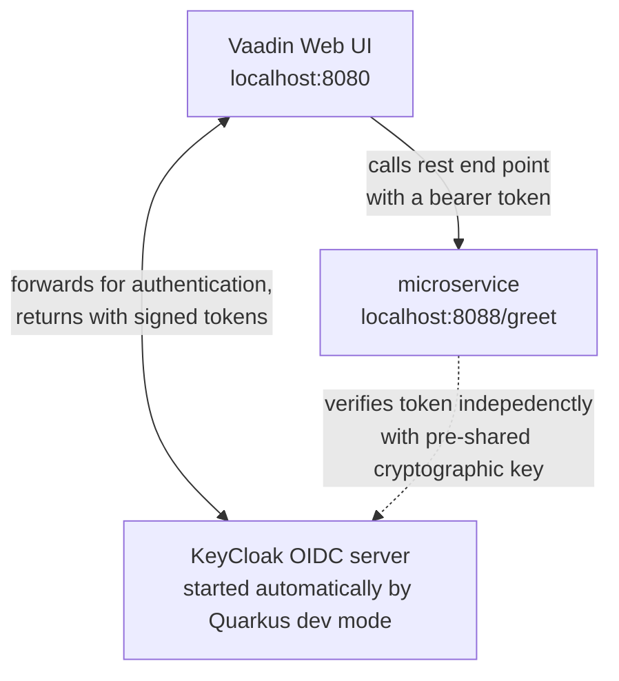
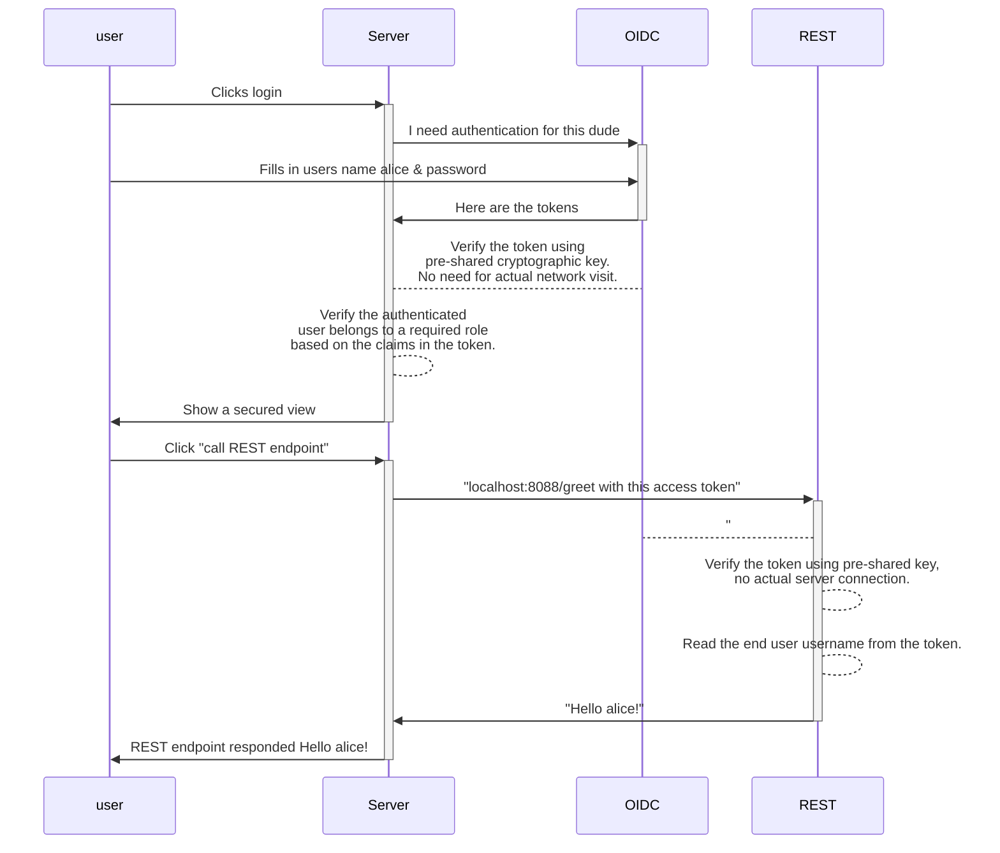

# Quarkus }> examples

This is a slightly more complex starting point for Quarkus based Vaadin apps. In addition to the core example, this has:

 * Top level navigation (via Viritin add-on, automatically picks available views to the menu)
 * Couple of views, off which only one is show by default
 * A simple authentication and authorization functionality with the Quarkus OpenID Connect integration
   * Implemented with KeyCloak as it is super handy with Quarkus automatically launching a KeyCloak instance for you for testing. Should be swappable to any OIDC provider.
   * Configuring ViewAccessChecker that takes care of redirecting to login view if user is not logged in when trying to access a view that requires authentication.
   * Accessing microservice/single-sign-on example: propagates the access token from the web UI to a microservice that reads the token. Here the service is a simple REST service in the same Quarkus app, but in a real world case most likely a separate service using the same OIDC service.

This project can be used as a starting point to create your own Vaadin Flow application for Quarkus. It contains all the necessary configuration with some placeholder files to get you started.

## Architectural diagrams

If you run both the vaadin-ui and microservice projects with `quarkus run`, you'll end up having following system running:



And what actually happens when a user logs in and uses the "call REST API" button in the UI:




## Requirements

 * Quarkus 3+ & Vaadin 24+ requires *Java 17*.
 * *Maven* (unless using via IDE)
 * *Docker* (Quarkus Dev mode needs that to launch KeyCloak instance)

## Running the Application

The main example is in the vaadin-ui directory.

Import the project to your favourite IDE as a Maven project for testing and browsing the code.

Run application with `mvn quarkus-dev` (CLI or IDE) within the vaadin-ui directory (or `quarkus dev`` if you have Quarkus CLI tools installed).

Quarkus will also launch a KeyCloak instance for you with Docker. Thus, the first startup can take a while.

Open [http://localhost:8080/](http://localhost:8080/) in browser.

There is also a trivial `microservice` project that can be started on the side. It opens a separate service to port 8088, with a trivial REST service. The rest service there connects to the same KeyCloak instance as the vaadin-ui project, if you start it with `mvn quarkus-dev`. The service does not require OIDC login, but if a token is provided, the greet message includes the user name in the response. The "Basic view" in the Vaadin UI has an example that calls that service and passes the Token from the web UI to the microservice.


### Including vaadin-jandex for Pro components

If you are using Pro components such GridPro you need to provide the Jandex index for them as well. 
Although, this can be achieved by adding their names one-by-one in the `application.properties` similar to the following example:
```properties
quarkus.index-dependency.vaadin-grid-pro.group-id=com.vaadin
quarkus.index-dependency.vaadin-grid-pro.artifact-id=vaadin-grid-pro-flow
```
Vaadin recommends using the official Jandex index for the Pro components which is published as part of the platform:
```xml
<dependency>
    <groupId>com.vaadin</groupId>
    <artifactId>vaadin-jandex</artifactId>
</dependency>
```
The above dependency has already added to the `pom.xml` and all you need to do is uncomment it when if needed. 
